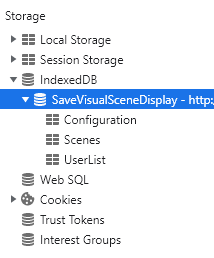

# Database tutorial

For this tutorial, I use Scene as an example source as well as the Google Chrome browser.

To see the database, right click then “inspect” or press F12. Choose App from the top tabs.


Then in storage expand indexed database and you will find the AugCom database and its various tables as well as their data.



This database if you decide to delete it from the browser, this database will reform automatically when you refresh the AugCom application page with default values, so you will lose all other users, grids etc…

The first thing to do for every database operation is an open query like the following:

```ts
this.openRequest = indexedDB.open('saveVisualSceneDisplay', 3);

      // ERROR
      this.openRequest.onerror = event => {
        alert('Database error: ' + event.target.errorCode);
      };

      // SUCCESS
      this.openRequest.onsuccess = event => {
```

## Add a table to the database

To add a table, just use the event to target the database then use the createObjectStore() function which is present in angular without a package and indicate the name of the table here 'Scene' and put in auto-increment.
```ts
const transaction = event.target.transaction;
```

## Add/modify/delete data in a table

To add data to a table, you must use the event to make a transaction.
```ts
const db = event.target.result;
db.createObjectStore('Scene', {autoIncrement: true});
```
Then, if you want to add data to the table, you must use 'add' giving the data as an argument, even if 'put' works the same way but it targets a key (here the 2nd argument is the key). If it exists, it will modify the contents of this key, otherwise it adds a line with the key and the data.
In the same way, to delete a line, simply use “delete” giving the key of the data to be deleted as an argument.
```ts
const scencesStore = transaction.objectStore('Scene');

paletteObjectStore.add(this.SCENES);
paletteObjectStore.put(this.SCENCES, this.userDBService.currentUser);
paletteObjectStore.delete(this.userDBService.currentUser);
```
